<!-- README.md is generated from README.Rmd. Please edit that file -->
[](https://travis-ci.com/dazamora/IDFtool) [](https://codecov.io/gh/dazamora/IDFtool)

IDFtool
=======

IDFtool computes intensity-duration-frequency curves per specific time duration and different return periods. The intensity-duration-frequency curves are used in hydrology to express in a synthetic way, fixed a return period (T) and a duration (d) of a rainfall event. IDFtool included an uncertainty analysis in PDFs and IDF curves, by bootstrap method.

Instalation
-----------

Currently, you can install the version under development from [Github](https://github.com/dazamora/IDFtool), using these commands:

``` r
install.packages("devtools")
devtools::install_github("dazamora/IDFtool")
```

Example
-------

Meteorology station in the Farfan Airport in Tulua, Colombia.

``` r
library(IDFtool)
data(inten)
Test.idftool <- IDFCurve(Data = inten, Station='2610516', Duration = FALSE,
                         Periods = FALSE, Type = "gumbel", M.fit = "lmoments",
                         Plot = 1234, Strategy = 1, logaxe = "", CI = FALSE, 
                         CIpdf = TRUE, iter = 50, goodtest = FALSE,
                         Resolution = 300, SAVE = FALSE, name = TRUE)
#> [1] "Just compute a strategy"
```

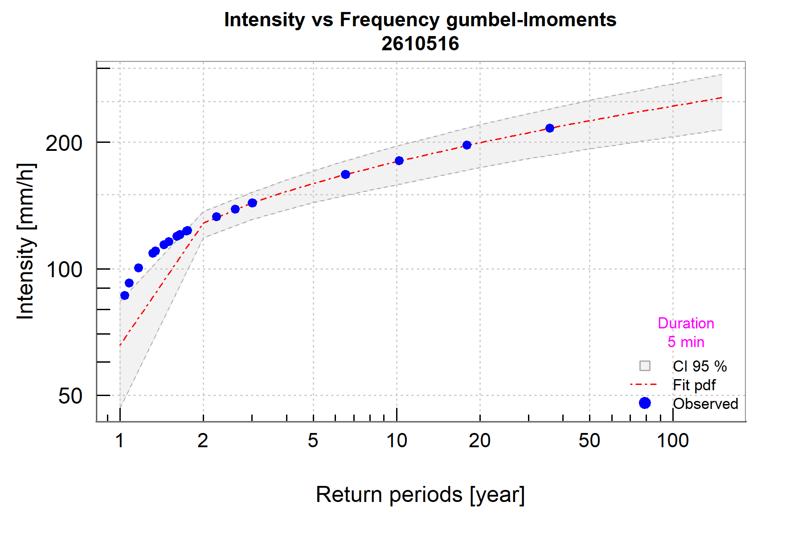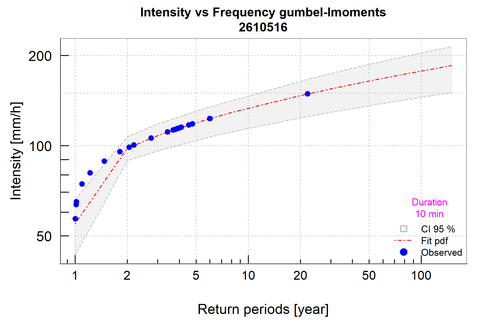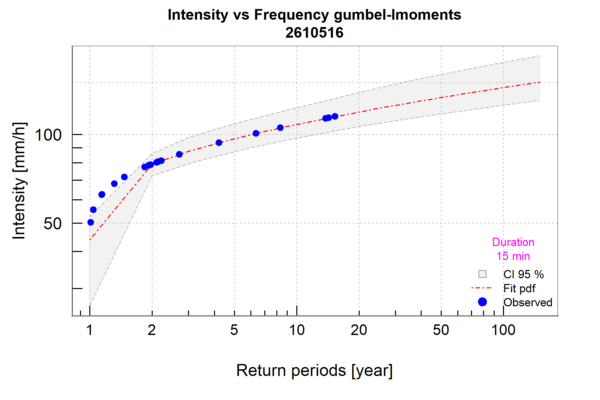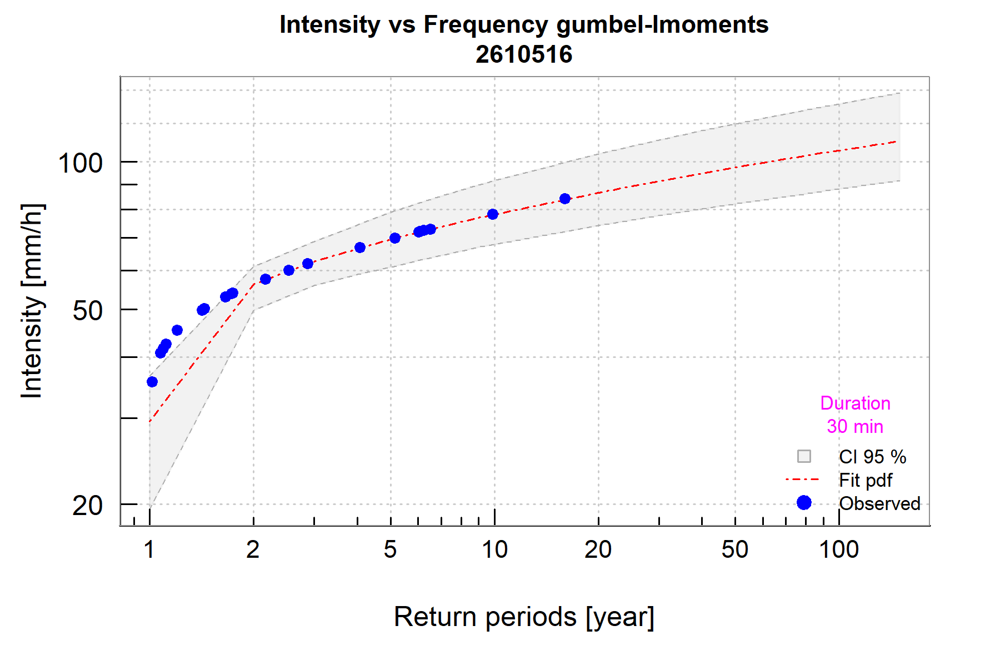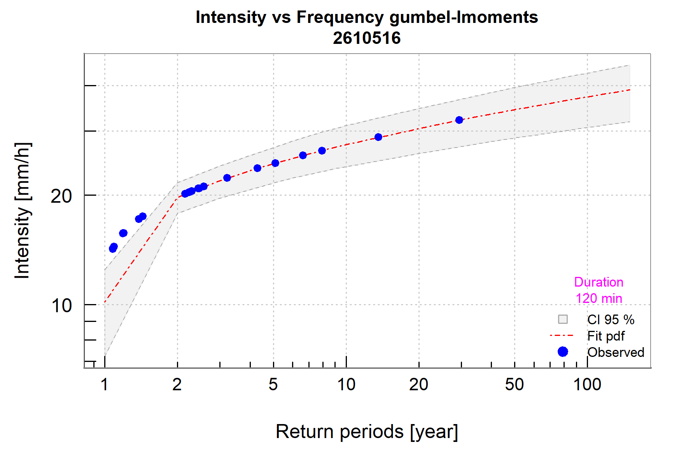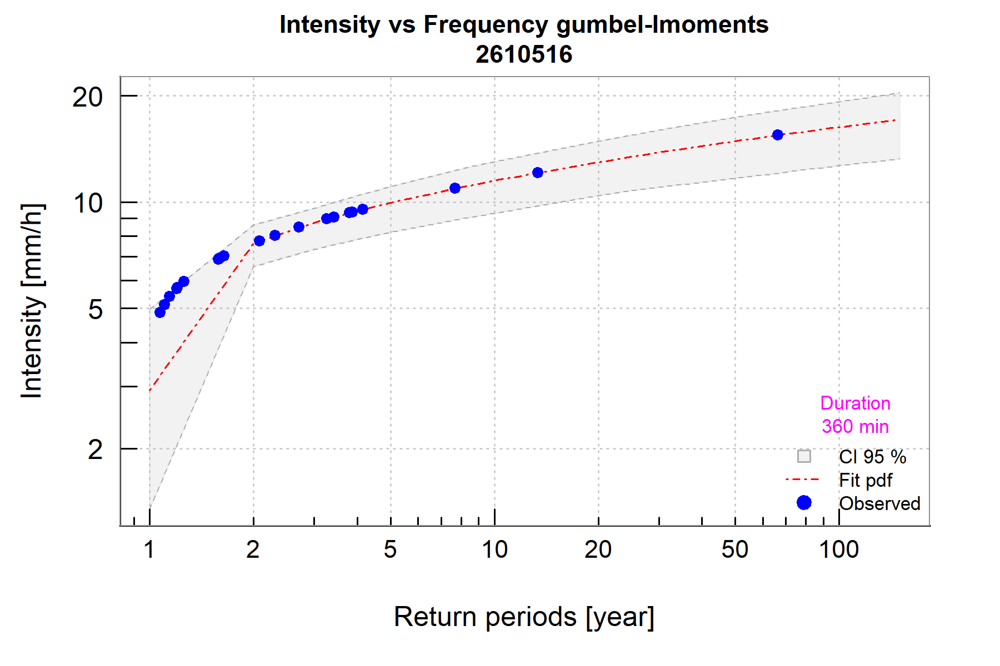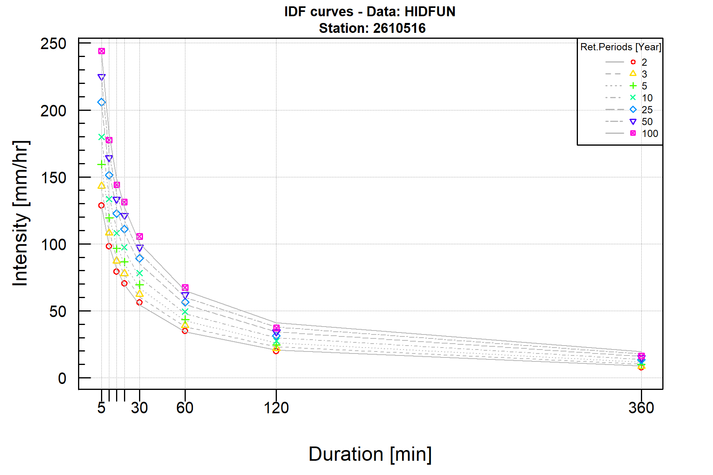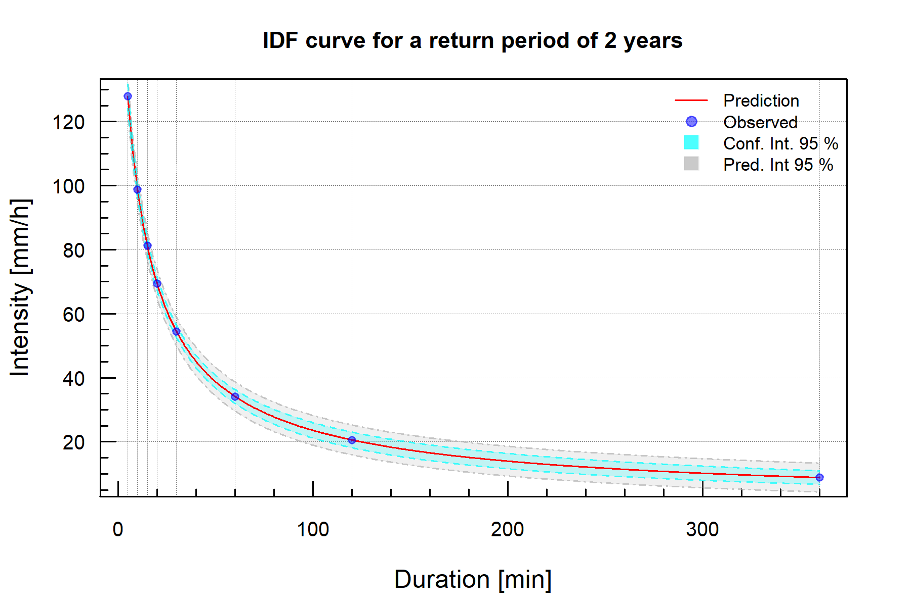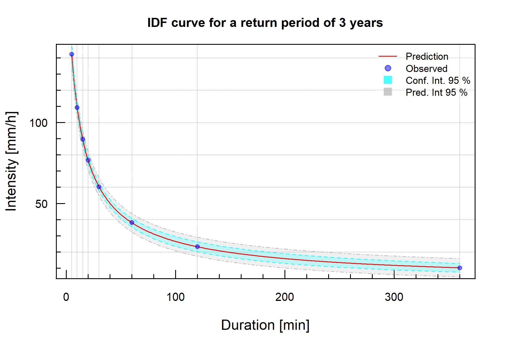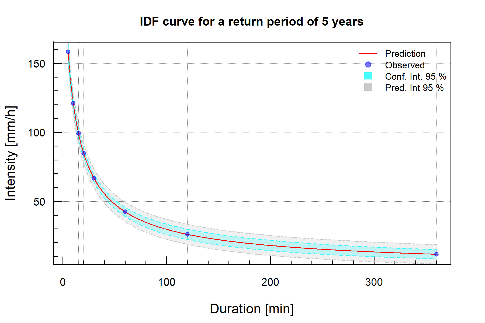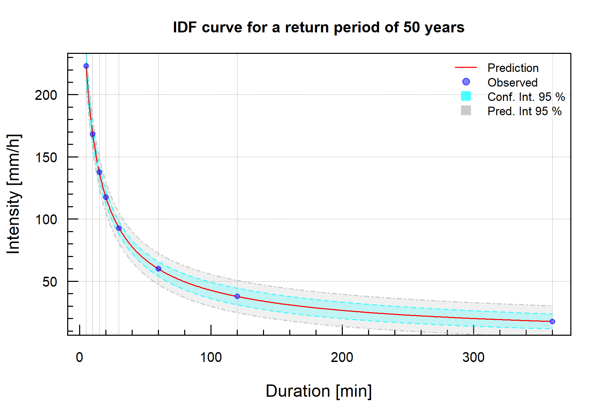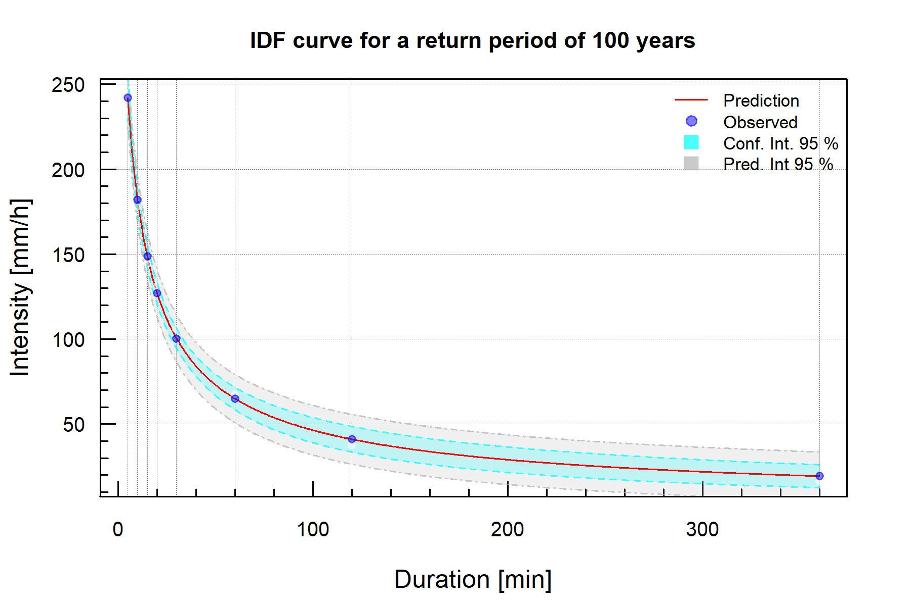
